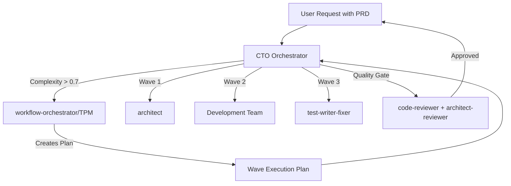
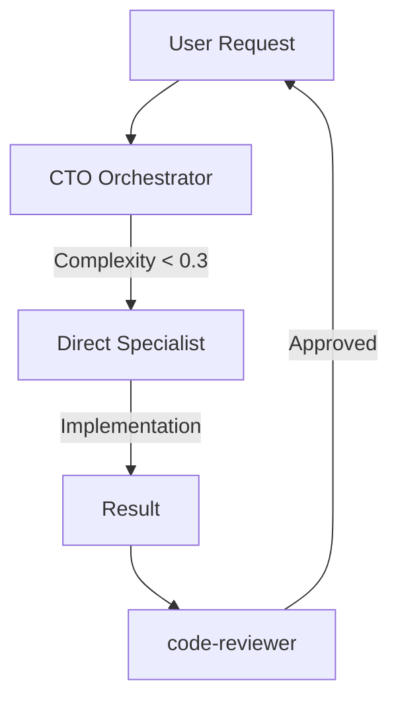
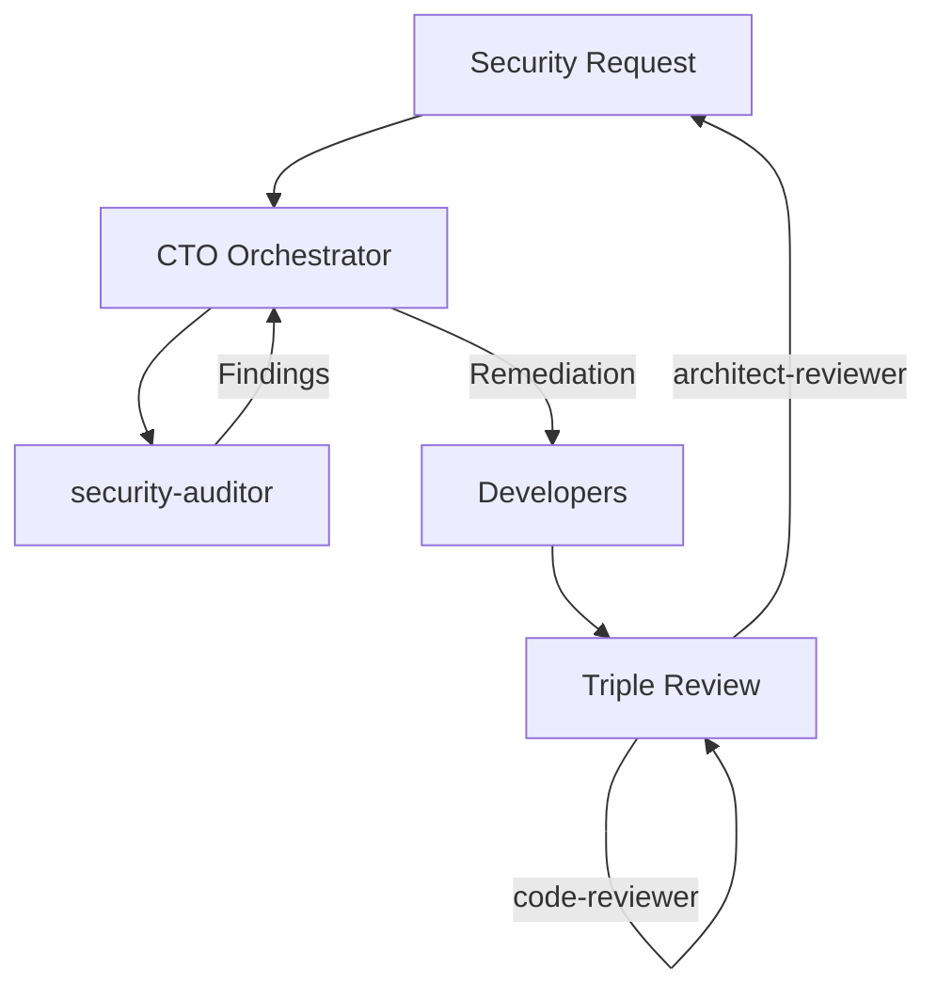

# Agent Collaboration Guide - CTO & Team Hierarchy

## 🏢 Organizational Structure

```
┌─────────────────────────────────────┐
│     CTO/Engineering Manager         │
│         (ctem agent)                │
│   "Strategic Orchestrator"          │
└──────────────┬──────────────────────┘
               │
       ┌───────┴───────┐
       │               │
┌──────▼──────┐ ┌──────▼──────────────┐
│     TPM     │ │  Quality Control    │
│ (workflow-  │ │  - code-reviewer    │
│ orchestrator)│ │  - architect-       │
│             │ │    reviewer         │
└──────┬──────┘ └────────────────────┘
       │
┌──────▼────────────────────────────┐
│     Implementation Teams          │
│  - Security & Architecture        │
│  - Development                    │
│  - Performance & Testing          │
│  - Innovation & Documentation     │
└───────────────────────────────────┘
```

## 🔄 Collaboration Workflows

### Workflow 1: Complex Project (PRD/Multi-week)



### Workflow 2: Simple Task (Direct Delegation)



### Workflow 3: Security-Critical Task



## 📋 Decision Matrix

### When CTO Uses workflow-orchestrator (TPM)

| Condition | Action | Example |
|-----------|--------|---------|
| Complexity > 0.7 | **Always** delegate to TPM first | "Build payment system" |
| PRD provided | **Always** delegate to TPM first | "Implement this PRD..." |
| Multi-week timeline | **Always** delegate to TPM first | "3-week project" |
| Cross-functional | **Always** delegate to TPM first | "Frontend + backend + DB" |
| Multiple phases | **Always** delegate to TPM first | "Phased rollout" |

### When CTO Delegates Directly

| Condition | Action | Example |
|-----------|--------|---------|
| Single domain | Direct to specialist | "Write Go function" |
| Bug fix | Direct to specialist | "Fix performance issue" |
| Simple review | Direct to reviewer | "Review this code" |
| Documentation | Direct to docs-architect | "Document this API" |

## 🎯 Agent Interaction Patterns

### Pattern 1: TPM-Led Planning
```python
# CTO receives complex request
if complexity > 0.7 or has_PRD:
    # Step 1: Get plan from TPM
    plan = Task(
        subagent_type="workflow-orchestrator",
        prompt="Create execution plan for: {request}"
    )
    
    # Step 2: CTO orchestrates the plan
    for wave in plan.waves:
        for agent in wave.agents:
            Task(subagent_type=agent, prompt=wave.task)
        
        # Quality gate after each wave
        Task(subagent_type="code-reviewer", prompt="Review wave output")
```

### Pattern 2: Quality Control Loop
```python
# After ANY implementation
def quality_control(implementation_type):
    reviews = []
    
    if "security" in implementation_type:
        reviews.extend(["security-auditor", "code-reviewer", "architect-reviewer"])
    elif "architecture" in implementation_type:
        reviews.extend(["architect-reviewer", "code-reviewer"])
    else:
        reviews.append("code-reviewer")
    
    for reviewer in reviews:
        result = Task(subagent_type=reviewer, prompt="Review implementation")
        if not result.approved:
            return "Revisions needed"
    
    return "Approved for production"
```

### Pattern 3: Parallel Specialist Coordination
```python
# For independent tasks
parallel_tasks = [
    Task(subagent_type="frontend-specialist", prompt="Build UI"),
    Task(subagent_type="golang-pro", prompt="Build API"),
    Task(subagent_type="docs-architect", prompt="Write docs")
]

# All execute simultaneously
results = execute_parallel(parallel_tasks)

# Single quality review for all
Task(subagent_type="code-reviewer", prompt=f"Review all: {results}")
```

## 🚦 Quality Gates

### Mandatory Review Points

1. **After Implementation**: Always code-reviewer
2. **After Architecture Changes**: architect-reviewer + code-reviewer
3. **After Security Changes**: security-auditor + code-reviewer + architect-reviewer
4. **Before Production**: Full review panel for critical systems

### Review Escalation

```markdown
Low Risk → code-reviewer only
Medium Risk → code-reviewer + specialist reviewer
High Risk → code-reviewer + architect-reviewer + specialist
Critical Risk → Full panel review + CTO approval
```

## 📊 Communication Protocols

### CTO ↔ TPM Communication
```markdown
CTO → TPM: "Create execution plan for {complex_project}"
TPM → CTO: "Plan ready: {waves}, {timeline}, {agents_needed}"
CTO: Orchestrates plan execution
```

### CTO ↔ Specialists Communication
```markdown
CTO → Specialist: "Execute {specific_task} with {context}"
Specialist → CTO: "Task complete: {deliverables}"
CTO → Reviewer: "Review {specialist_output}"
Reviewer → CTO: "Approved/Changes needed"
```

### Progress Reporting Chain
```markdown
Specialist → CTO (via TodoWrite): "Task 50% complete"
CTO → User: "Wave 2 in progress, 3 of 5 tasks complete"
```

## 🎭 Real-World Scenarios

### Scenario 1: E-commerce Platform
```markdown
User: "Build an e-commerce platform with cart, payments, and inventory"

CTO Analysis: Complexity = 0.92, Multi-domain, High risk
CTO → workflow-orchestrator: "Create e-commerce platform plan"

TPM Returns:
- Wave 1: Architecture + Database (architect, security-auditor)
- Wave 2: Core Features (frontend-specialist, golang-pro)
- Wave 3: Payments (security-auditor, golang-pro)
- Wave 4: Testing (test-writer-fixer, performance-optimizer)
- Wave 5: Polish (docs-architect, code-reviewer)

CTO Orchestrates: Each wave with quality gates
```

### Scenario 2: Performance Fix
```markdown
User: "Fix slow API endpoints"

CTO Analysis: Complexity = 0.45, Single domain, Medium risk
CTO → performance-optimizer: "Analyze and fix slow endpoints"
performance-optimizer → CTO: "Optimizations complete"
CTO → code-reviewer: "Review performance changes"
code-reviewer → CTO: "Approved, no risky configs"
CTO → User: "Performance improved by 73%"
```

## 🔑 Key Principles

1. **CTO is the single entry point** - All requests go through CTO
2. **TPM handles complex planning** - Not implementation
3. **Quality gates are mandatory** - No skipping reviews
4. **Specialists focus on expertise** - Deep, not broad
5. **Parallel when possible** - But serialize dependencies
6. **Document decisions** - Especially for complex projects

## 📝 Quick Reference

### Command Flow
```bash
# User command
"Build feature X"
    ↓
# CTO analyzes
Task(subagent_type="ctem", prompt="Build feature X")
    ↓
# CTO decides
if complex:
    Task(subagent_type="workflow-orchestrator", prompt="Plan feature X")
else:
    Task(subagent_type="[specialist]", prompt="Implement feature X")
    ↓
# Always quality check
Task(subagent_type="code-reviewer", prompt="Review implementation")
```

## 🚀 Benefits of This Hierarchy

1. **Clear Responsibilities**: Each agent knows their role
2. **No Overlap**: CTO orchestrates, TPM plans, specialists implement
3. **Scalable**: Easy to add new specialists
4. **Quality Built-in**: Mandatory review gates
5. **Efficient**: Parallel execution when possible
6. **Traceable**: Clear decision and execution path

Remember: The CTO orchestrator (ctem) is the conductor of this orchestra, ensuring every request gets the right expertise at the right time with proper quality control.