# CTO Orchestrator - Autonomous Agent Delegation System

## 🎯 Overview

The CTO Orchestrator is your autonomous engineering manager that analyzes every request and intelligently delegates to specialized sub-agents. Instead of manually selecting agents or updating configuration files, the CTO makes strategic delegation decisions based on confidence scoring and request analysis.

## 🚀 How It Works

### Single Entry Point
Instead of calling specific agents, you invoke the CTO for EVERYTHING:

```python
# Old way (manual selection)
Task(subagent_type="security-auditor", prompt="Check for vulnerabilities")
Task(subagent_type="golang-pro", prompt="Write concurrent code")

# New way (CTO orchestration)
Task(subagent_type="cto-orchestrator", prompt="Check for vulnerabilities")
Task(subagent_type="cto-orchestrator", prompt="Write concurrent Go code")
```

### Intelligent Delegation Flow

```mermaid
graph TD
    A[User Request] --> B[CTO Orchestrator]
    B --> C{Analyze Request}
    C --> D[Calculate Confidence]
    D --> E{Confidence Level?}
    E -->|High ≥0.8| F[Single Agent]
    E -->|Medium 0.5-0.79| G[Primary + Support]
    E -->|Low <0.5| H[Multi-Agent Team]
    F --> I[Execute & Monitor]
    G --> I
    H --> I
    I --> J[Deliver Results]
```



## 📊 Confidence-Based Routing

### High Confidence (≥ 0.8)
**Behavior**: Immediate delegation to specialist
```markdown
User: "Scan my API for security vulnerabilities"
CTO: "I'm routing this to our security specialist..." 
     → security-auditor (0.95 confidence)
```

### Medium Confidence (0.5 - 0.79)
**Behavior**: Delegation with supporting agents
```markdown
User: "Optimize the checkout process"
CTO: "Based on the performance issues, I'm engaging our optimization team..."
     → performance-optimizer (0.75) + frontend-specialist (0.60)
```

### Low Confidence (< 0.5)
**Behavior**: Full team coordination
```markdown
User: "Build a real-time collaborative editing system like Google Docs"
CTO: "This requires our cross-functional team. Orchestrating multiple specialists..."
     → Wave 1: architect + workflow-orchestrator
     → Wave 2: frontend-specialist + performance-optimizer + ai-engineer
     → Wave 3: security-auditor + test-writer-fixer
```

## 🎭 Real-World Examples

### Example 1: Security Request
```python
# User request
"Check my authentication system for vulnerabilities"

# CTO Analysis
REQUEST ANALYSIS:
━━━━━━━━━━━━━━━━━━━━━━━━━━━━━━━━━━
Intent: Security audit of auth system
Complexity: 0.7
Domains: [Security, Authentication, Backend]
Risk Level: High

DELEGATION:
Primary: security-auditor (0.95)
Secondary: architect-reviewer (0.70)
Strategy: Sequential

# Execution
1. security-auditor performs OWASP audit
2. architect-reviewer checks design patterns
3. Results compiled and presented
```

### Example 2: Go Development
```python
# User request
"Write a concurrent worker pool in Go"

# CTO Analysis
REQUEST ANALYSIS:
━━━━━━━━━━━━━━━━━━━━━━━━━━━━━━━━━━
Intent: Go implementation with concurrency
Complexity: 0.55
Domains: [Golang, Concurrency]
Risk Level: Medium

DELEGATION:
Primary: golang-pro (0.98)
Strategy: Single Agent

# Execution
golang-pro implements with channels and goroutines
```

### Example 3: Complex System Design
```python
# User request
"Design and implement a scalable real-time chat system"

# CTO Analysis
REQUEST ANALYSIS:
━━━━━━━━━━━━━━━━━━━━━━━━━━━━━━━━━━
Intent: Full system design and implementation
Complexity: 0.92
Domains: [Architecture, Real-time, Frontend, Backend, Scale]
Risk Level: High

DELEGATION:
Wave 1: workflow-orchestrator + architect
Wave 2: frontend-specialist + golang-pro
Wave 3: security-auditor + performance-optimizer
Wave 4: test-writer-fixer + docs-architect

# Execution
Multi-wave orchestration with checkpoints
```

## 🔧 Configuration

### Option 1: Always Use CTO (Recommended)
Add to your CLAUDE.md:
```markdown
## Primary Agent Strategy
For ALL technical requests, invoke the CTO orchestrator:
Task(subagent_type="cto-orchestrator", prompt=user_request)

The CTO will autonomously:
1. Analyze the request
2. Calculate confidence scores
3. Select appropriate specialists
4. Orchestrate execution
5. Deliver results
```

### Option 2: Hybrid Approach
Use CTO for complex/unclear requests, direct agents for simple tasks:
```markdown
if request_complexity > 0.3 or unclear_intent:
    use cto-orchestrator
else:
    use specific_agent
```

## 📈 Delegation Patterns

### Sequential Pattern
For dependent tasks:
```
architect → security-auditor → code-reviewer
Each agent's output feeds the next
```

### Parallel Pattern
For independent tasks:
```
performance-optimizer ═══╗
frontend-specialist ═════╬═══> Combined Results
docs-architect ══════════╝
All agents work simultaneously
```

### Wave Pattern
For complex projects:
```
Wave 1: Planning (20% effort)
Wave 2: Core Implementation (40% effort)
Wave 3: Quality & Security (25% effort)
Wave 4: Polish & Documentation (15% effort)
```

## 🎯 When CTO Excels

The CTO orchestrator is particularly effective for:

1. **Ambiguous Requests**: "Make my app better"
2. **Multi-Domain Problems**: "Build secure, fast, scalable API"
3. **Complex Projects**: "Implement real-time collaboration"
4. **Unknown Scope**: "Fix the issues in my codebase"
5. **Strategic Decisions**: "Should we use microservices?"

## 🚦 Monitoring & Feedback

The CTO provides transparency:

```markdown
CTO: "Analyzing your request..."
CTO: "Identified as a security-critical task (confidence: 0.92)"
CTO: "Delegating to security-auditor as primary"
CTO: "Adding architect-reviewer for design validation"
CTO: "Execution strategy: Sequential with checkpoints"

[Progress updates during execution]

CTO: "Task completed. Security audit found 3 issues (2 critical, 1 minor)"
```

## 💡 Best Practices

### DO:
✅ Let CTO analyze all requests first
✅ Trust the confidence scoring
✅ Allow multi-agent orchestration for complex tasks
✅ Provide clear, detailed requests
✅ Include context about your system

### DON'T:
❌ Override CTO without good reason
❌ Skip CTO for "simple" tasks (it's often not simple)
❌ Manually coordinate multiple agents
❌ Assume single agent is always sufficient

## 🔄 Continuous Improvement

The CTO learns from:
- Success/failure patterns
- User feedback
- Agent performance metrics
- Task completion times
- Quality of deliverables

## 📝 Quick Reference

```python
# Always invoke CTO for autonomous delegation
Task(
    subagent_type="cto-orchestrator",
    prompt="[Your request here]",
    description="Strategic orchestration"
)

# CTO handles:
# - Request analysis
# - Confidence scoring
# - Agent selection
# - Execution strategy
# - Progress monitoring
# - Result compilation
```

## 🎬 Getting Started

1. **Install ClaudeNext** with all agents (including CTO)
2. **Set CTO as default** orchestrator in your workflow
3. **Start with any request** - the CTO handles everything
4. **Watch the delegation** happen automatically
5. **Receive coordinated results** from the specialist team

The CTO Orchestrator transforms Claude Code from a tool into an autonomous engineering team, with you as the executive providing direction while the CTO handles all tactical decisions and team coordination.